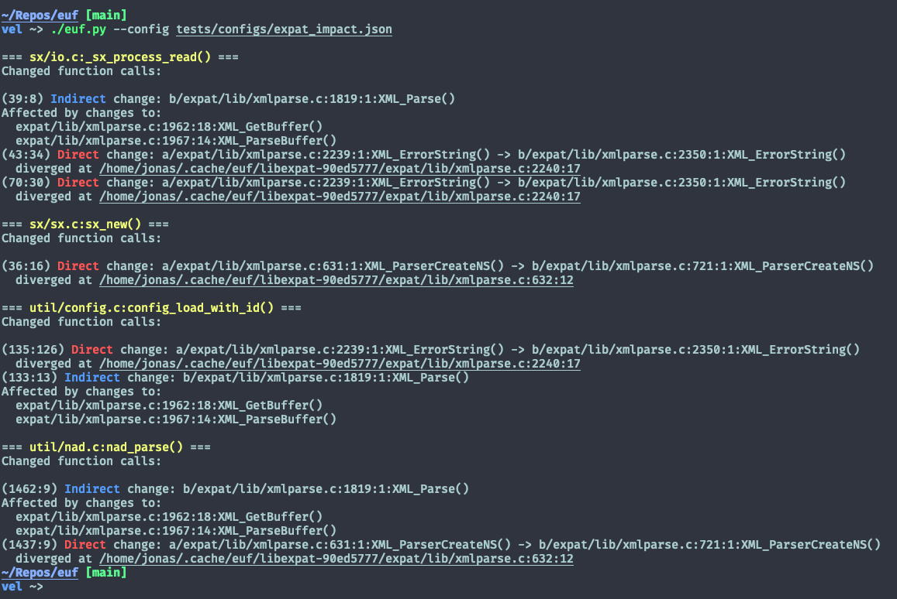
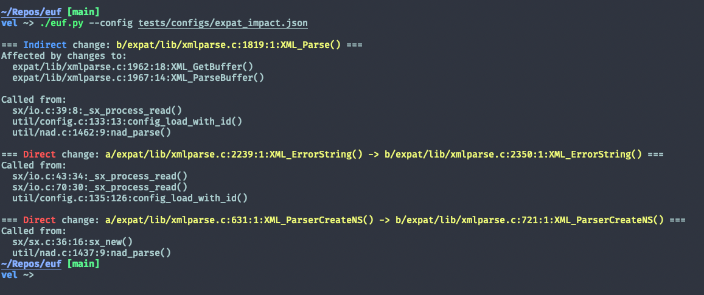

# euf

## Installation
EUF has four core dependencies:
* Python >=3.10, required to support type hints and the `match` keyword
* Clang 13, required for the clang-plugins module and Python's libclang bindings
* Bear, used to generate compilation databases for libclang
* CBMC, the core tool for equivalence analysis 

To setup the project, clone all submodules and refer to `./scripts/setup.sh` or build a Docker image.

```sh
git clone --recursive https://github.com/Kafva/euf.git

# Automatic setup for Arch or Ubuntu 20.04
./scripts/setup.sh

# Docker setup
# Additional setup steps will likely be necessary
# to build the projects being analyzed and the docker
# configuration is therefore split into two separate images
docker build --rm --tag=euf-base -f Dockerfile.base .
docker build --rm --tag=euf . # Derived from Dockerfile.base
```

Every invocation of EUF requires a JSON config file as an argument. The format of the config file is described in `src/config.py` and there are several examples present in the repository.

```sh
(venv) ./euf.py --config tests/configs/basic.json

# The dependency (oniguruma), the main project (jq),
# and the configuration all need to be mounted when using Docker
docker run -it \
  -v /home/jonas/Repos/jq:/home/euf/Repos/jq \
  -v /home/jonas/Repos/oniguruma:/home/euf/Repos/oniguruma \
  -v $PWD/tests/configs:/home/euf/configs \
  euf --config /home/euf/configs/docker.json
```

## CBMC fork
To avoid duplicate symbols a fork of CBMC which adds a suffix to all global symbols has been created. The symbol renaming is triggered by starting `cbmc`, `goto-cc` or any of the other Cprover tools with `USE_SUFFIX` set in the environment.

## Tests
Unit tests for the functions of the actual script are ran with
```sh
pytest tests/test_*
```

## Implementation notes
EUF compiles the old and new version of the dependency _twice_, once using `bear` to generate a compile commands database and once with `goto-cc` to create a version of the library that CBMC can interact with. Combining these steps would have been preferable but doing so seems unsupported, (no commands are recorded in `compile_commands.json` if `CC` is overriden with `goto-cc`).

Running EUF within and outside Docker on the same repositories is not supported,
create seperate directories if this is neccessary.

## Interpreting the output
EUF can be invoked with a `VERBOSITY` value from 0-3, setting the verbosity to zero will only print errors and a prettified version of the impact set. Higher values will print information regarding each analysis stage. 

With minimum verbosity, EUF will give each impact site its own header and print a list of related changes beneath it. Listing dependency changes mapped to a list of affected call sites can sometimes create output that is easer to oversee and is possible by toggling the `ORDER_BY_CALL_SITE` option.

Changes are categorized as either *direct* or *indirect*. A direct change to a function infers that the AST of the old and new version differs. An indirectly changed function is a function which calls one or more functions with either a direct or indirect change.

The impact set presented by EUF will only consider changed functions that are reachable from the main project based on AST traversal. For example, in the image below `util/nad.c:nad_parse()` has been affected by an indirect change to `XML_Parse`. The indirect change originates from direct (or additional indirect) changes in `XML_GetBuffer` and `XML_ParseBuffer`, neither of which are directly called in the main project. Each change is prefixed with the line and column number of the invocation within the current file.




A complete canonical representation of the impact set will always be written to `./results/<dependency>_<new>_<old>/impact_set.json` for further analysis.

The change set given from AST diffing can be visualised by providing the `--diff` flag. This will show the exact line and column where two functions diverge followed by the textual git-diff for each modified file.
